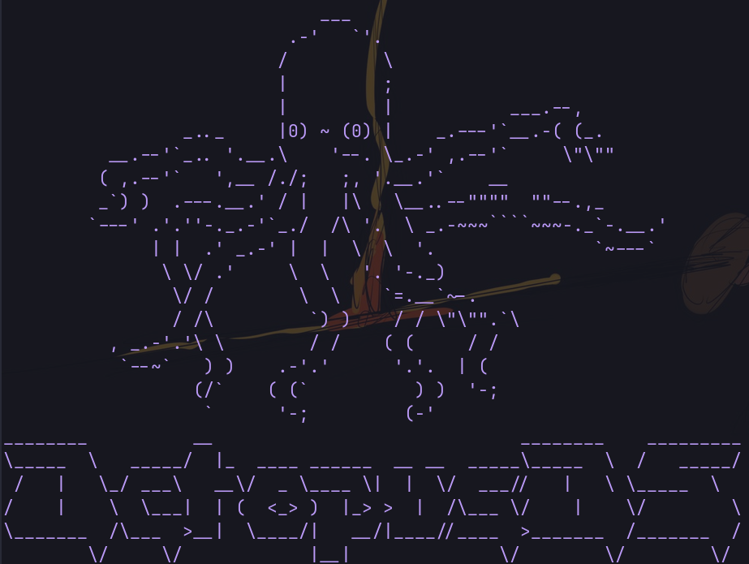
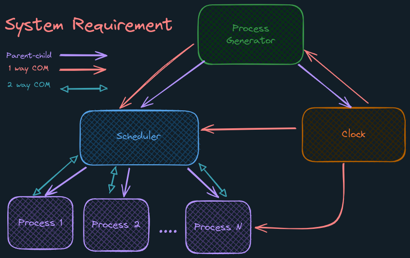

<h1 align="center">
    🐙 OctopusOS 🐙
</h1>

---

OctopusOS: if you got tired of your boring windows and want something more fun and with more limbs try OctopusOs, OctopusOs is a multi-process scheduler and memory manager simulator made for Linux.


https://github.com/AbdelruhmanSamy/OctopusOS/assets/88613195/e4b596fc-5632-4a02-b5d5-4f957bde0441

---

## 👾 Features:

- **RR** (Round Robin) Scheduling
- **SJF** (Shortest Job First) Scheduling
- **HPF** (Highest Priority First) Scheduling
- Doubly list, Priority Queue, Queue, and binary tree data structures implementation.
- Memory management with **buddy system** algorithm.
- Multi-process scheduler process clock generator for maximum use of **IPC** (Inter-Process Communication).
- **GUI** built with C and raylib/raygui library.
- Expressive output featuring:
  - Log all process info in scheduler.log
  - Log all memory info in memory.log
  - performance metrics in scheduler.perf
  - Fancy Terminal output and **ASCII art**.
  - Images exported of the system each run include the scheduler log and perf log.

> [!NOTE]
> GUI is a bonus feature you can do it with any language you want Ex: `JS(Electron)`



## 🧰 Tech Stack:

- C lang
- `raylib` for GUI.

## 🚀 Quick Start:

- Clone the repository
- ensure you have make and `raylib` installed.
- Run make in `code` folder.

```bash
make
```

<!-- <h1 align="center">
    
    <br/>
</h1> -->

> [!CAUTION]
> In memory management we didn't handle not having enough space for a process.

## System Requirement

<h2 align="center">
    
    <br/>
</h2>
